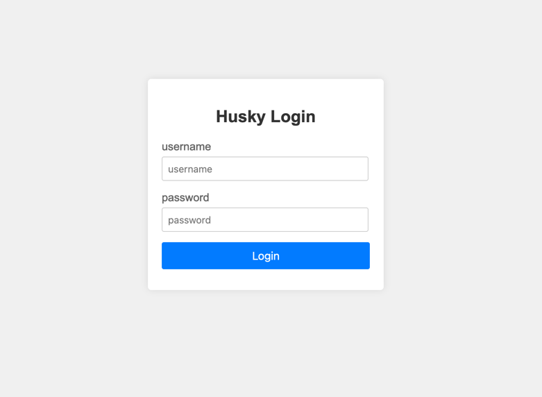

## Husky项目简介
Husky(哈士奇)是一个Docker容器镜像制作系统，项目诞生于2018年7月，至今已在多家公司内部使用，于2024年6月25日起开源。
系统默认支持使用Maven包管理的Java 8、Nodejs、C++语言开发的Docker镜像制作，可按需扩展和定制化开发，使用多阶构建可
支持绝大多数的开发语言。系统主要特色功能：精准灵活的用户权限控制、简单易用易扩展、支持API自动化。
### 使用环境要求：
1. 部署服务器最低安装配置1核1G，存储空间10G，适实际使用情况提高配置。
2. 部署服务器必需安装Docker，并且能够访问用于存放打包好的Docker镜像仓库。
3. 部署服务器能够访问Git代码仓库，账号拥有拉取代码的权限，并配置使用SSH KEY登录访问。

### 安装步骤(以下操作可根据实际情况调整)
1. 在部署服务器上，使用如下Docker命令部署PostgreSQL数据库。
```
docker run -d --name husky_postgres -p 5432:5432 -e POSTGRES_USER=husky -e POSTGRES_PASSWORD=husky -e POSTGRES_DB=Husky -v /data/husky/postgres:/var/lib/postgresql/data --restart=always postgres:16.3-alpine3.20
```
2. 使用DataGrip或Navicat等数据库管理工具，连上Postgres数据库，执行如下SQL语句，创建表结构。
```
create sequence sequence_id;

create table build_project
(
    project_id         serial
        primary key,
    project_name       varchar(255) not null,
    repository_address varchar(255) not null,
    latest_image       varchar(255)
);

create table build_registry
(
    registry_id      serial
        primary key,
    registry_name    varchar(255) not null,
    registry_address varchar(255) not null
);

create table husky_user
(
    password   varchar(255) not null,
    username   varchar(255) not null
        constraint user_pkey
            primary key,
    permission jsonb not null
);

INSERT INTO public.husky_user (password, username, permission) VALUES ('admin', 'admin', '{"project_id": [], "registry_id": []}');
```
演示数据，按需执行（非必要步骤）
```
--- 插入演示项目
INSERT INTO public.build_project (project_id, project_name, repository_address, latest_image) VALUES (2, 'venus', 'git@gitlab.io/group/venus.git', null);
INSERT INTO public.build_project (project_id, project_name, repository_address, latest_image) VALUES (4, 'gaea', 'git@gitlab.io/group/gaea.git', null);
INSERT INTO public.build_project (project_id, project_name, repository_address, latest_image) VALUES (1, 'zeus', 'git@gitlab.io/group/zeus.git', '');
INSERT INTO public.build_project (project_id, project_name, repository_address, latest_image) VALUES (3, 'apollo', 'git@gitlab.io/group/apollo.git', 'apollo:202406251111-master-6666666');
--- 插入演示镜像仓库
INSERT INTO public.build_registry (registry_id, registry_name, registry_address) VALUES (1, 'dev', 'dev.registry.io');
INSERT INTO public.build_registry (registry_id, registry_name, registry_address) VALUES (2, 'prod', 'prod.registry.io');
INSERT INTO public.build_registry (registry_id, registry_name, registry_address) VALUES (3, 'test', 'test.registry.io');
--- 插入演示账号
INSERT INTO public.husky_user (password, username, permission) VALUES ('test', 'test', '{"project_id": [1, 4], "registry_id": [3]}');
INSERT INTO public.husky_user (password, username, permission) VALUES ('guest', 'guest', '{"project_id": [0], "registry_id": [0]}');
```
3. 修改`ssh/id_rsa`填入SSH KEY私钥。
4. 根据实际使用情况修改如下环境变量后，执行run.sh脚本启动。
* `DB_HOST` 数据库地址，默认：localhost
* `DB_PORT` 数据库端口，默认：5432
* `DATABASE` 数据库名称，默认：Husky
* `DB_USER` 数据库用户名，默认：husky
* `DB_PASSWORD` 数据库密码，默认：husky
* `SECRET_KEY` JWT加密密钥，默认：Husky
* `TOKEN_EXPIRE_TIME` Token过期时间，默认：8小时
5. ssl的证书文件按需替换（非必要步骤）
6. 使用命令`docker ps -a`查看到容器状态为`healthy`，即可使用浏览器访问：`https://your_server_ip` 看到登录界面即部署成功。


### 使用说明
1. Maven的配置文件`settings.xml`，可按需添加到容器内`/usr/share/java/maven-3/conf/`路径下。
2. Maven下载的包如需持久化存储，可以使用`-v /data/husky/maven:/root/.m2`挂载出来。
3. 日志存储路径`/var/log/nginx`可按需挂载。
4. 用户权限由husky_user表的`{"project_id": [], "registry_id": []}`管理控制，
为空表示拥有所有权限，禁用权限设置对应的id为`0`即可。
5. 增加修改项目，需要修改数据库`build_project`表项目信息和`/script/build.sh`脚本的`build`方法。
6. 默认账号密码为：`admin`

### 接口使用说明

1. 登录
```
curl -H "Content-Type: application/json" -XPOST http://127.0.0.1/api/login -d '{"username":"admin","password":"admin"}'
```
2. 获取项目
```
curl http://127.0.0.1/api/projects -H 'Token: ${token}'
```
3. 获取镜像仓库
```
curl http://127.0.0.1/api/registry -H 'Token: ${token}'
```
4. 打包镜像
```
curl -H "Content-Type: application/json" -H 'Token: ${token}' -XPOST http://127.0.0.1/api/build -d '{"project_id": 1, "ref": "master", "register_id": 1}'
```

### 注意事项
1. 为了安全起见，部署服务器尽量放在内网使用，并且严格限制服务器的访问权限。
2. 数据库所有表带了`id`均为自增ID。
3. 前端页面每100条项目信息为一页。
4. 关闭页面即可注销登录。

### 未完待续
1. 密码加密存储，并支持修改密码
2. ......